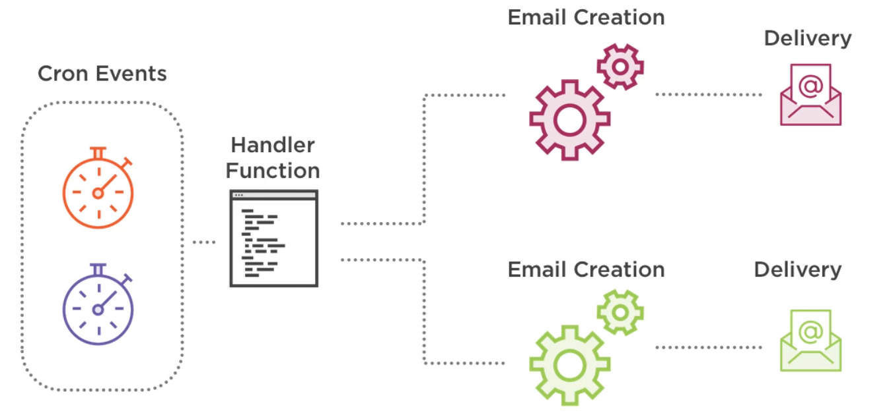

# serverless-node-cron

An AWS Cloudwatch Event using cron syntax that triggers an SES email reminder.



This function runs using the serverless `schedule` event. More information can be found in the documentation [here](https://serverless.com/framework/docs/providers/aws/events/schedule/).

You can use the `schedule` event with either `rate` or `cron`.

## Rate

```
rate(value unit)
```

`value` - A positive number

`unit` - The unit of time. This can be any of the following: `minute`, `minutes`, `hour`, `hours`, `day`, `days`.

**Example** `rate(3 days)`

If you have questions about the rate syntax checkout the [AWS docs](http://docs.aws.amazon.com/AmazonCloudWatch/latest/events/ScheduledEvents.html#RateExpressions)

## Cron syntax

```pseudo
cron(Minutes Hours Day-of-month Month Day-of-week Year)
```

One important note is that if using either the day of month or the day of week you must fill the position of the other with a `?`.

For more information read the documention for the AWS cron expression syntax [here](http://docs.aws.amazon.com/lambda/latest/dg/tutorial-scheduled-events-schedule-expressions.html).

## Deploy

In order to deploy this code and follow along with what's happening you simply run:

```bash
serverless deploy -v 
```

That's it! Seriously! The `-v` will let you see the verbose output of what's happening behind the scenes.